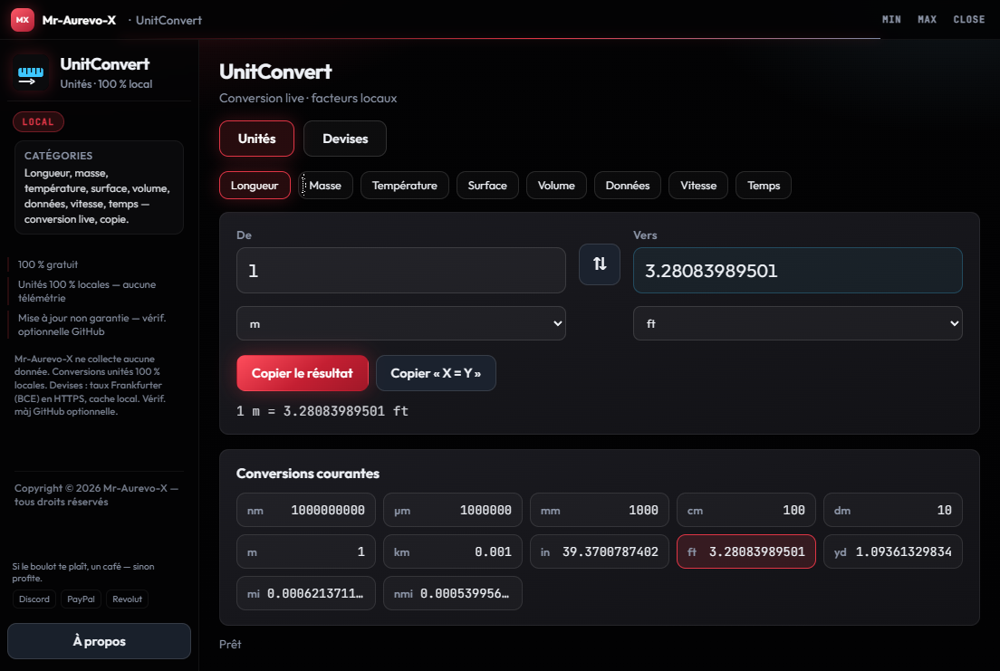

# UnitConvert

**[Download UnitConvert.exe](https://github.com/Mr-Aurevo-X/UnitConvert/releases/latest/download/UnitConvert.exe)** · **[All releases](https://github.com/Mr-Aurevo-X/UnitConvert/releases)**

> Direct Windows binary (latest). Open [Releases](https://github.com/Mr-Aurevo-X/UnitConvert/releases) if the right-sidebar "Releases" link is scrolled away — downloads are **not** under "Tags".

**© 2026 Mr-Aurevo-X — UnitConvert — 100% local — free — updates not guaranteed**

Convertisseur d'unités et de devises — unités 100 % locales, devises via Frankfurter (ex-DeviseConvert).  
Multi-category unit + currency converter — units 100% local, currencies via Frankfurter (ex-DeviseConvert).


## Capture d'écran / Screenshot



## Download / Téléchargement

- **One-click:** [UnitConvert.exe](https://github.com/Mr-Aurevo-X/UnitConvert/releases/latest/download/UnitConvert.exe)
- **Release notes / all versions:** [github.com/Mr-Aurevo-X/UnitConvert/releases](https://github.com/Mr-Aurevo-X/UnitConvert/releases)

Double-cliquer sur `UnitConvert.exe` pour lancer (pas d'installation).  
Double-click `UnitConvert.exe` to run (no install).

Windows peut afficher « potentiellement dangereux » : les binaires ne sont pas signés Authenticode (pas de certificat éditeur payant). C’est un avertissement de réputation SmartScreen, pas un verdict antivirus.  
Windows may flag the app as potentially unsafe: binaries are not Authenticode-signed (no paid publisher certificate). That is a SmartScreen reputation warning, not an antivirus verdict.

## Fonctions / Features (v1.2)

- **Unités** : longueur, masse, température, surface, volume, données (bit/B/KB/MB/GB/TB + KiB/MiB/GiB), vitesse, temps
- **Devises** (ex-DeviseConvert) : EUR, USD, GBP, CHF, JPY, CNY… — taux BCE via Frankfurter, cache hors ligne (`deviseconvert-rates.json`)
- Onglets **Unités | Devises** ; conversion live, inversion, copie ; table « conversions courantes » (unités)
- **Unités 100 % locales** — facteurs embarqués, aucun réseau pour convertir
- **Devises** — réseau optionnel pour actualiser les taux ; cache local pour usage hors ligne

## Legal / Légal

| FR | EN |
|:--|:--|
| **100 % gratuit** | **100% free** |
| **Unités 100 % locales** — aucun cloud, aucune télémétrie | **Units 100% local** — no cloud, no telemetry |
| **Devises** — taux indicatifs BCE via Frankfurter (HTTPS), cache local | **Currencies** — indicative ECB rates via Frankfurter (HTTPS), local cache |
| **Mise à jour non garantie** — pas d’obligation / pas de SLA ; l’app *peut* vérifier GitHub Releases | **Updates not guaranteed** — no obligation / no SLA; the app *can* check GitHub Releases |
| **Copyright © 2026 Mr-Aurevo-X** — tous droits réservés | **Copyright © 2026 Mr-Aurevo-X** — all rights reserved |

Licence : **proprietary / all rights reserved** (voir `LICENSE`).  
Redistribution, reverse engineering ou suppression des mentions de copyright **interdits** sans accord écrit.

## Lancer (exe primary)

**Double-clic `UnitConvert.exe`** — lancement principal, sans flash CMD.

| Fichier | Usage |
|:--|:--|
| `UnitConvert.exe` | **Principal** — binaire windowed (après `Build.cmd`) |
| `Lancer.bat` / `UnitConvert.bat` | Si l'exe est présent → `start` l'exe puis exit ; sinon fallback `pythonw` détaché |
| `Lancer.cmd` | Même logique (alias optionnel) |

Dev / sans exe :

```powershell
python -m venv .venv
.\.venv\Scripts\pip install -r requirements.txt
.\Lancer.bat
```

## Build .exe

```powershell
cd "C:\Users\aurel\Documents\Dev Central Tree\Git Vitrine Public\UnitConvert"
.\Build.cmd
```

Produit `dist\UnitConvert.exe` puis copie vers `UnitConvert.exe` à la racine.  
Le `.exe` peut être gitignoré — rebuild via `Build.cmd`.  
Pour publier une màj : bumper `VERSION`, build, créer une **GitHub Release** avec l’asset `UnitConvert.exe`.

## Version & mises à jour (optionnel)

- Fichier version : `VERSION` à la racine (ex. `1.2.0`).
- Au démarrage, vérif. **non bloquante** de `https://api.github.com/repos/Mr-Aurevo-X/UnitConvert/releases/latest`.
- **Appels réseau optionnels** : vérif. / màj GitHub ; actualisation des taux devises (Frankfurter). Les conversions **unités** restent 100 % locales.

## UI kit

Chrome propriétaire : SoT `Dev Central Tree\02_Shared_Infrastructure\UI-proprietaire\` → `ui\vendor\pc-command-kit`  
Sync : `.\scripts\Sync-All-UiKit.ps1` depuis la racine Dev Central Tree (**ne pas** éditer le vendor à la main).

## Stack

Python · pywebview · PyInstaller · PC Command kit

## Soutien / Support

Coups de pouce volontaires · optional tips (app remains free) :

[](https://www.paypal.com/paypalme/aurevo1)
[](https://revolut.me/mr_aurevo_x)
---

Rêvée par **Mr-Aurevo-X**. Cursor a réalisé le rêve.

[Discord](https://discord.com/users/406891052516114442) · [PayPal](https://www.paypal.com/paypalme/aurevo1) · [Revolut](https://revolut.me/mr_aurevo_x)
